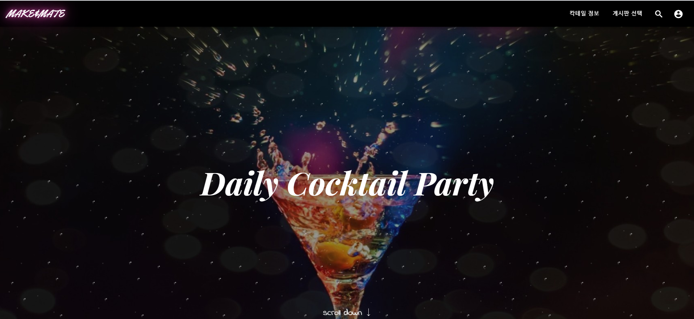
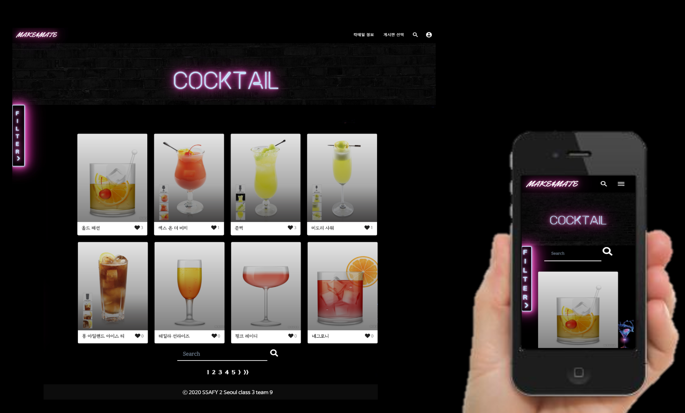
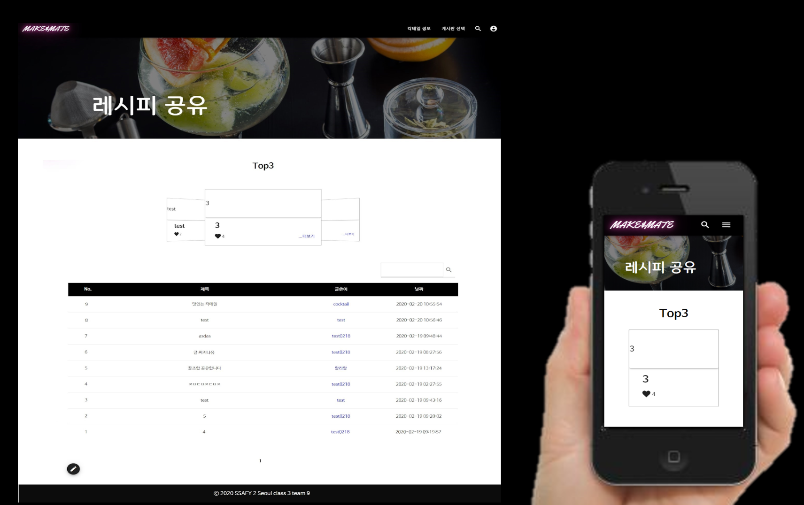
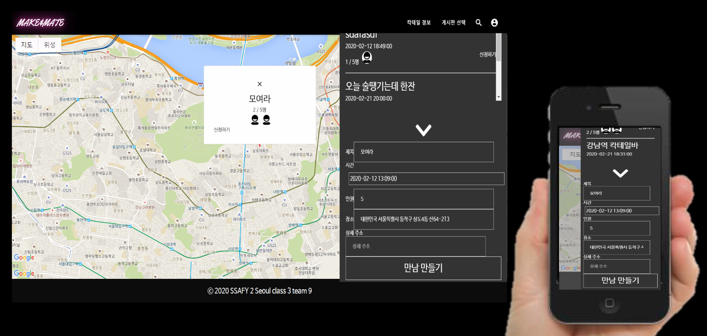
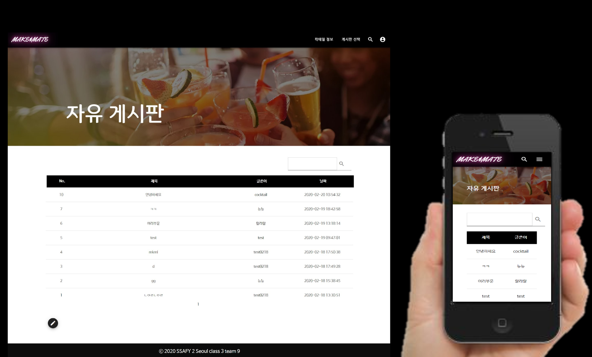
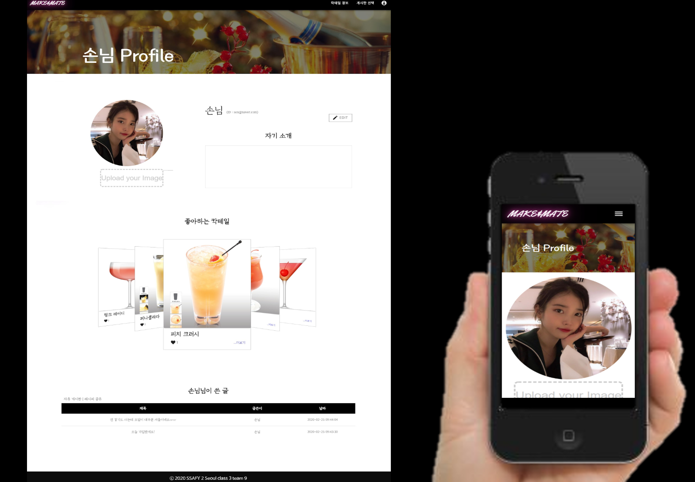
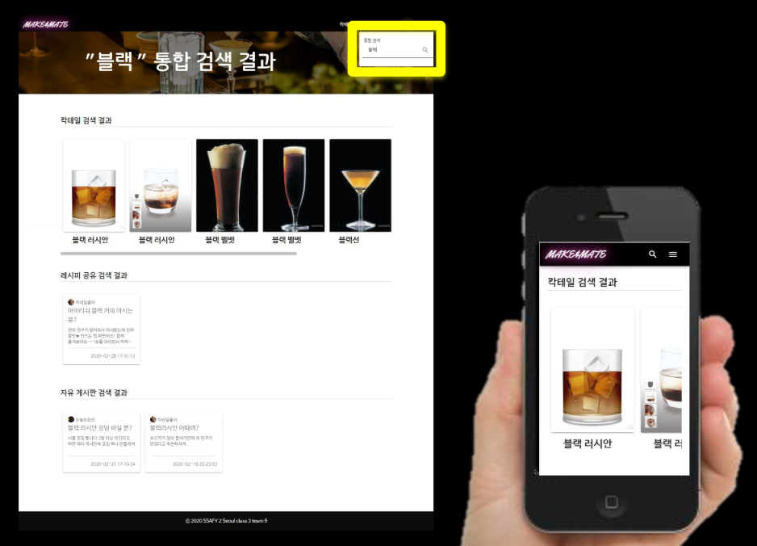

# MAKE&MATE🍸



- 칵테일로 새로운 맛을 소개하고 함께 즐기러 가는 SNS

  

## Installation

```git
git clone https://github.com/hyunhee418/cocktail_project.git
npm install
```


## 서비스 소개

- 기본 칵테일의 정보를 얻을 수 있는 **'칵테일 정보'**

- 칵테일 레시피 공유를 위한 **'레시피 공유'**

- 칵테일 번개 모임을 주도할 수 있는 **'칵테일 파티'**

- 그 외 글을 올릴 수 있는 **'자유 게시판'**

- 사용자 간 정보를 공유하는 **'User profile'**

  

## 개발 스택

### Front

* Vue
* Vuex


### Server

* Spring Boot
* Spring Security
* JPA
* JWT
* SSL


## 기능 세부 정보

### 칵테일 정보

- DB에 저장된 칵테일 정보의 List를 제공합니다.
- 각 칵테일에 대한 세부 정보를 볼 수 있습니다.
  - 해당 칵테일의 유래, 재료, 만드는 법 등
  - Filter / 검색을 통해원하는 칵테일을 찾을 수 있습니다. 




### 레시피 공유

- '나만의 칵테일 레시피'를 공유합니다.
- 글 작성 시 필요한 재료에 대한 정보를 제공할 수 있습니다.
- 레시피 공유에서 유용한 글을 스크랩하였다면 사용자 페이지에서 스크랩한 글을 확인할 수 있습니다. 




### 칵테일 파티

- 지도에 마커를 찍는 형식의 게시판 
- 해당 글에는 모임의 참여자, 약속 시간 등의 정보를 볼 수 있습니다.




### 자유게시판

- 칵테일에 대한 정보글, 친목글 등을 올릴 수 있습니다.




### 사용자 페이지

- 사용자 프로필을 확인하여 서로에 대한 정보를 볼 수 있습니다.
- 프로필 사진, 자기소개, 좋아하는 칵테일, 사용자가 쓴 글이 있습니다.
- 본인 프로필 페이지에서는프로필 사진 업로드, 자기소개 수정이 가능합니다.




### 통합 검색 페이지

- 통합검색을 통해칵테일 / 레시피 공유 / 자유 게시판의 글을검색할 수 있습니다.




## Member

### 업무 분담 내역

|        김우재        |              손현희              |             이근성              |                 정윤영                 |
| :------------------: | :------------------------------: | :-----------------------------: | :------------------------------------: |
| 공유게시판 기능 구현 |          데이터 크롤링           |             Account             |               Main page                |
| 자유게시판 기능 구현 |  Cocktail List 기능 구현 및 css  |   로그인, 회원가입 기능 구현    |          navbar / footer css           |
|       DB 구축        | Cocktail Detail 기능 구현 및 css | 스프링 시큐리티 & JWT 기능 구현 | 로그인 / 회원가입 계정 관련 페이지 css |
|     동영상 편집      |   Userprofile 기능 구현 및 css   |            SSL 적용             |  자유 게시판 / 레시피 공유 게시판 css  |
|                      |   Usermypage 기능 구현 및 css    |            서버 배포            |    유저 스크랩 backend 구현 및 css     |
|                      |         칵테일 파티 css          |    좋아요 및 댓글 기능 구현     |             통합 검색 css              |
|                      |  비밀번호 변경 / 회원 탈퇴 css   |      칵테일 파티 기능 구현      |                                        |


## 프로젝트 진행 과정 (2020.01.13 - 2020.02. 20)

2020년 01월 14일 환경 설정

2020년 01월 17일 로그인, 회원가입 frontend 구현

2020년 01월 20일 회원가입 메일인증 구현, 데이터 크롤링, mockup

2020년 01월 21일 네비게이션 바 생성, 소셜 로그인 백엔드 기능 구현

2020년 01월 23일 비밀번호 변경, 마이페이지, success페이지 기능 구현

2020년 01월 29일 cocktail list, 로그인 기능, main 페이지 구현

2020년 02월 03일 filter, comment 기능 구현

2020년 02월 05일 list 뒤로가기, Board CRUD기능 구현

2020년 02월 06일 칵테일 좋아요 기능 구현, navbar 수정

2020년 02월 10일 user profile 기능 구현, main page 디자인 개선

2020년 02월 11일 board, recipe 좋아요, cocktail 페이지 디자인

2020년 02월 13일 kakao Login 기능 구현

2020년 02월 16일 404, mypage, navbar, 로그인 회원가입 화면 CSS

2020년 02월 18일 게시판 검색 frontend 기능 추가, 검색기능, 유저프로필 내가쓴 글 기능 구현

2020년 02월 19일 칵테일 파티 기능 구현

2020년 02월 20일 CSS 전반 수정 및 테스트 1차 개발


## URL

### 배포 URL

* https://i02a309.p.ssafy.io/

  

### 회의록

* https://docs.google.com/document/d/1CsF6YbY6IuiJMgqETVhGmH7pYD4ciSwHBmHB5E7MQtM/edit
* https://docs.google.com/document/d/1zQThnfe1wjh9gQxxKIQEJCpn4jOg-wIsdeMaw7W57u0/edit
* https://docs.google.com/document/d/1IhIKeQhUVWyVT5qiLLjqwy_k_Jr1YiGPbxud-A35ZR4/edit


### Mockup

* https://docs.google.com/presentation/d/1BXQEHroWSI5lxQpYSYuEatTPWl1AyTyVSS-9CjsZqrI/edit#slide=id.p


### 중간발표 자료

* https://docs.google.com/presentation/d/1h9TEdbaoQopmr-6NW-vrjoJafVGlojxecEeLT6LQtqA/edit#slide=id.g7e7418e8a7_1_264


### UCC 콘티

* https://docs.google.com/presentation/d/1y4qb3FG3gLaWOr8won8H9rSal09rviqeP3id0MM94NQ/edit#slide=id.p